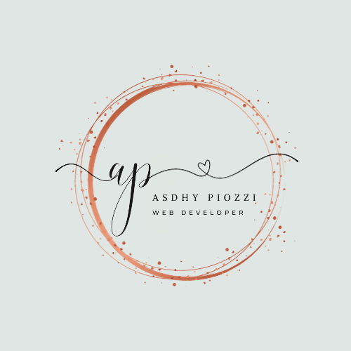

# Portfolio

## Overview
This is a portfolio website to demonstrate the skills acquired during the first three weeks of Coder Academy booth camp. This is a work in process and will add features in readme that I implement in website.

## Componenets

### Header
Header is located at the first part of the website, within it are the logo, name and the following navigation bars:

    * Home
    * About
    * Contact

Code for the header:

```html
<header>
    <div class="logo-name">
        <a href="./index.html">
            
        </a>
        <p class="name">
            <span class="asdhypiozzi-text">Asdhy Piozzi</span>
        </p>
    </div>

    <nav id="nav-items">
        <a href="./index.html">Home</a>
        <a href="./pages/about.html">About</a>
        <a href="./pages/contact.html">Contact</a>
    </nav>
</header>
```

